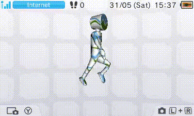

## pycgfx
`pycgfx` is a tool for converting glTF models into the CGFX format supported by the Nintendo 3DS's home menu banners, as well as the Python library backing it.

[Normal texture demo](https://github.com/KhronosGroup/glTF-Sample-Assets/blob/main/Models/CompareNormal/README.md)


[Skinned mesh animation demo](https://github.com/KhronosGroup/glTF-Sample-Assets/blob/main/Models/CesiumMan/README.md)



The tool supports a number of glTF features:
* .gltf and .glb files
* Diffuse and normal textures
* Constant roughness factor, for specular lighting
* Double-sided materials and alpha blend settings
* Animations and skinning
* Diffuse colour animation using `KHR_animation_pointer`

All animations are played at once.

## Usage

The `gltflib` and `pillow` libraries are required. They can be installed via `pip`, or by running `pipenv sync`.

Following this, simply run the `main.py` script through the command line, with your input file as an argument:
```bash
# With pipenv
pipenv run python main.py input.glb
# Windows, no pipenv
python main.py input.glb
# macOS / Linux, no pipenv
python3 main.py input.glb
```
CGFX files larger than 512KB are not supported by the 3DS, and this tool will print a warning if one is generated.

Some features useful for banners, such as billboarding (useful for logos), are not supported by the glTF specification.
These can be enabled after processing using ImHex (see below), or by modifying the script.
If there is demand, I'm open to working with users to figure out some kind of config file for configuring lights or marking bones as billboards.

## Additional assets
Also included in the repository is an [ImHex](https://imhex.werwolv.net/) pattern ([cgfx.hexpat](https://github.com/skyfloogle/pycgfx/blob/main/cgfx.hexpat)), with which CGFX files can be viewed and edited.
Be warned that reading it uses several gigabytes of RAM.

There is also a small glTF ([banner.gltf](https://github.com/skyfloogle/pycgfx/blob/main/banner-camera.gltf)) specifying the camera used in the 3DS home menu, for use during creation of banner models.
